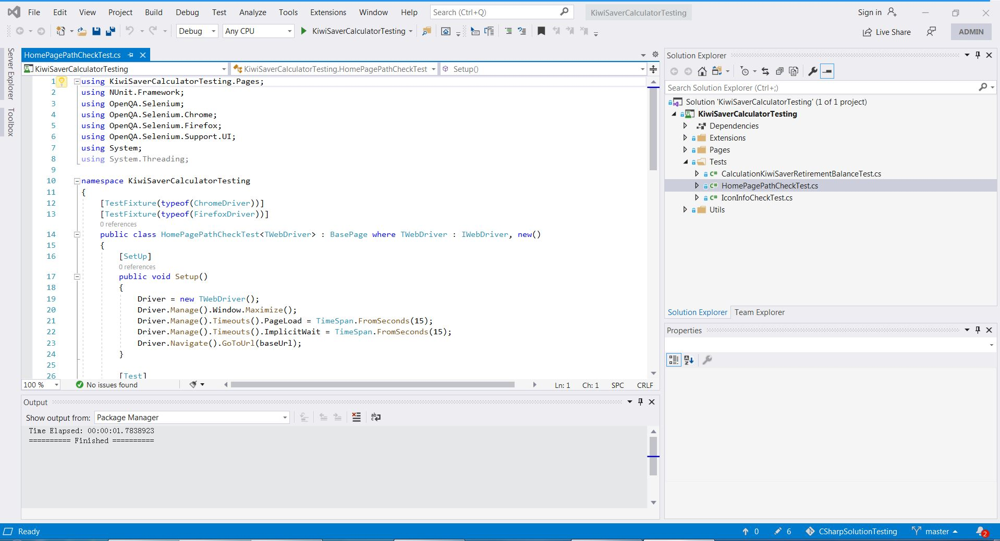
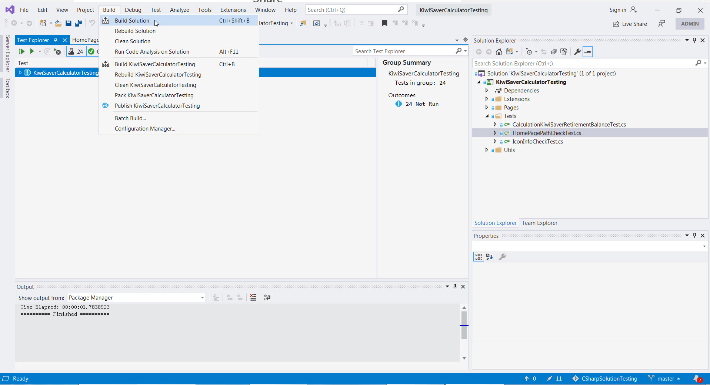
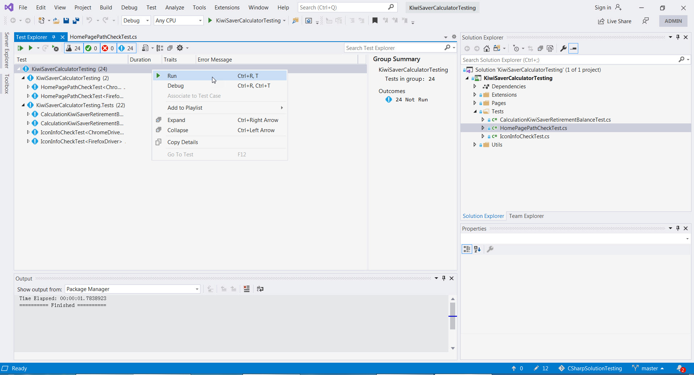
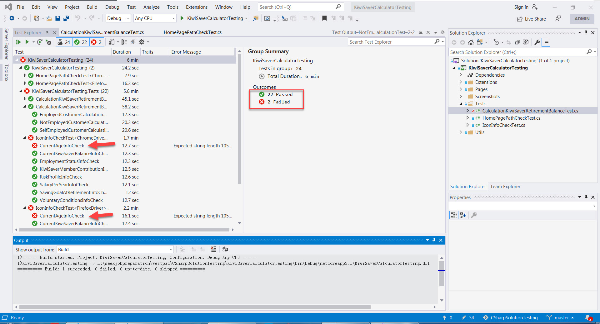
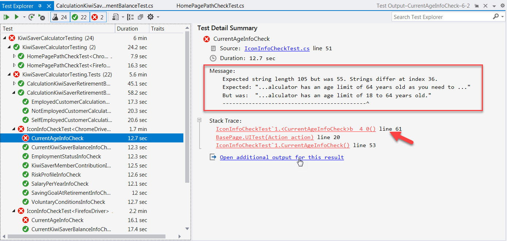
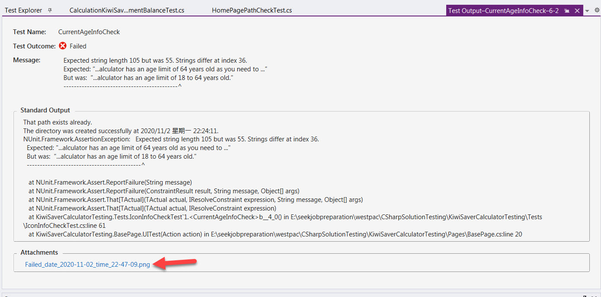
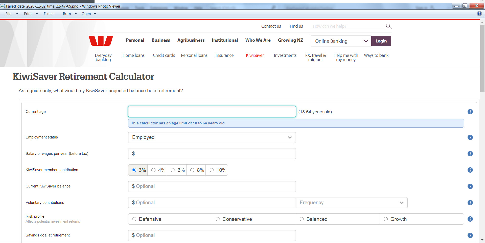
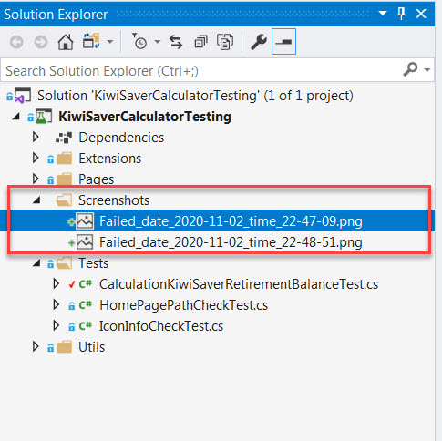

# CSharpSolutionTesting
This is an end to end example automation testing solution by using CSharp + NUnit (.net core) + Selenium WebDriver. 

The testing supports multiple browsers (current setting is for runing the testing with Chrome and Firefox).

Here are links of NUnit and Selenium

[NUnit](https://nunit.org/)

[Selenium](https://www.selenium.dev/documentation/en/)


## Prerequisites
+ Visual Studio 2019 (Windows version)
  
  Version: 16.7.7

+ Browsers 
  
  Chrome: Version 86.0.4240.111 

  Firefox: Version 82.0.2 

## Git clone the repo to local directory
```
cd /your/project/path
git clone https://github.com/MaxnzWZ/CSharpSolutionTesting.git (through https)
or
git clone git@github.com:MaxnzWZ/CSharpSolutionTesting.git (through ssh) 
``` 
## How to run test cases
### Open the project with Visual Studio (open KiwiSaverCalculatorTesting.sln)


### Open test explore


### Build solution


### Select test suites in test explore; right click and select Run to run testing


### Check test result
#### Check summary of test result


#### Check failed test case


#### Check detailed information of failed test case


#### Check screenshot of failed test case


#### Screenshots can be found in Screenshots under project folder

